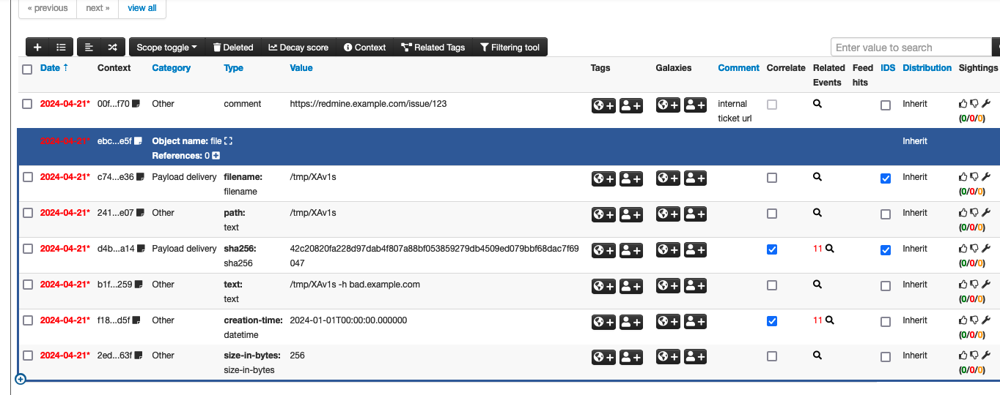

# cli-misp
CLIからMISPイベントを作成するツール
### Input
以下プロンプトにしたがって入力する。値が不明な場合は未入力でEnter。

### Output
上記実行後にMISPにイベントが作成される。

## 事前準備
#### Python
1. [Python 3.12.3](https://www.python.org/downloads) をインストール
2. CLIで、`python3 -V` できることを確認
3. CLIで、`pip3 -v` できることを確認
4. `pip3 install --upgrade pip` でpip3を最新化する

#### Git
1. [Git](https://gitforwindows.org/) をインストール
2. CLIで、`git -v` できることを確認

## インストール
1. `git clone https://github.com/fukusuket/cli-misp.git`
2. `cd cli-misp`
3. `pip3 install -r requirements.txt`
4. `python3 cli-misp.py`でエラーにならないことを確認
5. MISP URL を`cli-misp.py`の9行目にセットする
6. MISP API KEY を`cli-misp.py`の10行目にセットする

## 使い方
`python3 cli-misp.py` で実行すると、以下入力を求められるので適宜入力する。

## ツールが付与するコンテキスト
### Taxonomy
- https://www.circl.lu/doc/misp-taxonomies/#_tlp_2
- https://www.circl.lu/doc/misp-taxonomies/#_course_of_action
- https://www.circl.lu/doc/misp-taxonomies/#_estimative_language
- https://www.circl.lu/doc/misp-taxonomies/#_workflow

### Galaxy
- 付与しない