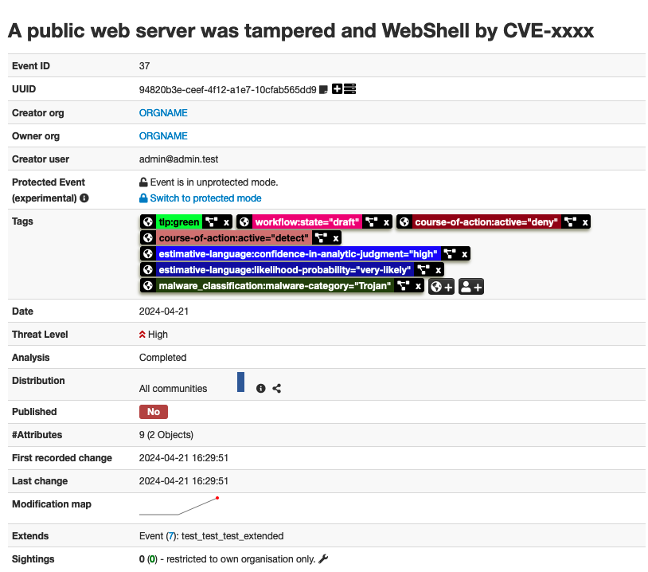

# cli-misp
CLIからMISPイベントを作成するツール
### Input
以下プロンプトに従い入力。**(*)** は必須項目。それ以外の項目で不明(or不要)な場合は、未入力+EnterでOK。

### Output
上記実行後にすると以下のようなEventがMISPに作成される。

## 事前準備
#### Python
1. [Python 3.12.3](https://www.python.org/downloads) をインストール
2. CLIで、`python3 -V` できることを確認
3. CLIで、`pip3 -v` できることを確認
4. `pip3 install --upgrade pip` で`pip3`を最新化する

#### Git
1. Gitをインストール
2. CLIで、`git -v` できることを確認

## インストール
1. `git clone https://github.com/fukusuket/cli-misp.git`
2. `cd cli-misp`
3. `pip3 install -r requirements.txt`
4. MISPのURLを`cli-misp.py`の11行目にセットする 
5. MISPのAPIキーを`cli-misp.py`の12行目にセットする
6. `python3 cli-misp.py`を実行し、エラーにならないことを確認(URL/APIキー間違いの場合はエラー終了する)

## 使い方
`python3 cli-misp.py` を実行し、順次プロンプトに入力する。
#### `UUID of an existing Event`に入力する値
- 新規Event作成時: **未入力**でOK
- 既存Event更新時: 更新対象の**自組織**のEvent UUID
- 他組織Eventの拡張時: **他組織**のEvent UUID

#### `Event info`に入力する値
可能な範囲で以下3要素を含める。Event受領組織がアクションできるようにする。
- Where（どこで）
- What（なにが）
- How（どのように）

例： `Public web server of financial system was compromised by WebShell exploiting CVE-XXXX`

## ツールが付与するコンテキスト
### Taxonomy
- https://www.circl.lu/doc/misp-taxonomies/#_tlp_2
- https://www.circl.lu/doc/misp-taxonomies/#_course_of_action
- https://www.circl.lu/doc/misp-taxonomies/#_estimative_language
- https://www.circl.lu/doc/misp-taxonomies/#_workflow

### Galaxy
- 付与しない（手動で付与する）
